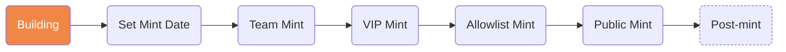

#   Rizzibles NFT ([@rizzibles](https://twitter.com/rizzibles))
*3,333 hand-drawn quiet nerdy artist writer types making their way in web3.*

A blockchain art project made by [GEMS - SolVisitors](https://twitter.com/SolVisitors) (DeGod #4773 / y00t #13382), [member of DeBuilders](https://debuilders.xyz/sol_visitors_imprints)

## Public information about the Rizzibles NFT project

**IMPORTANT NOTE: All information contained in this document is subject to change (you'll be able to see what changed with each update using Github's diff functionality). As with many things in the web3 ecosystem, this project is an experiment, intended to entertain and educate. Nothing should be construed as financial advice, you should always DO YOUR OWN RESEARCH (DYOR), and we make no promises that you will financially benefit by participating in our art project. With that out of the way, let's get to it!**

### Project Overview
- Blockchain: Solana
- Mint date: TBD
- Supply: 3,333
- Public mint price: 0.69 SOL
- "#rizzlist" price: 0.42 SOL
- "#rizzbassador" VIP mint price: 0.069 SOL
– IP Rights Licensing: Possibly something from here [Can’t Be Evil NFT Licenses](https://a16zcrypto.com/introducing-nft-licenses/)

### Project Socials
- Website: [rizzibles.com](https://rizzibles.com/)
- Twitter: [@rizzibles](https://twitter.com/rizzibles)
- Discord: [https://discord.com/invite/TF7zW5q9Ur](https://discord.com/invite/TF7zW5q9Ur)*
- Current "#rizzbassador" VIP List - [https://twitter.com/i/lists/1623049286840877056](https://twitter.com/i/lists/1623049286840877056)

\* Our Discord community was originally created for the [Sol Visitors](https://solvisitors.com/) project. We are using it as our organizing home base, since there will be rewards for holding a [Sol Visitors First Wave: IMPRINT NFT](https://magiceden.io/marketplace/sol_visitors_imprints)

## Current Status

## (Some of our) to-do items - public [committments](#committments) detailed below:
- [X] Finish CM3 frontend minting site for Rizzcards mint - launched to holders only on Feb 23, 2023
- [ ] Finalize Reveal Capsule NFT design
- [ ] Award free mints to selected First 100 Followers
- [ ] Design / launch "#rizzcademey"
- [ ] Create detailed #rizzenomics document
- [ ] What is #rizzfactor, why is it important, and what's it good for? (probably a staking multiplier?)
- [ ] Create "Legend of #rizz" lore document
- [ ] Collect wallet details for First 100 Followers / #rizzbassadors / VIPs
- [ ] Explore possible rewards for staking. Custom SPL token? Existing token?
- [ ] Decide on final method for exchanging 3 Rizzcard NFTs for 1 free Rizzibles mint

### About the project
Rizzibles is a "degen-mint" style project intended to entertain, educate, and possibly reward early holders. The artist / dev behind it is GEMS, aka [@SolVisitors](https://twitter.com/SolVisitors). The project is being used to explore and test various web3 technologies (for example Metaplex Candy Machine v3, Certified Collections, Metaplex Enforced Royalties standard (pNFT), Staking, and Rewards). The cost to mint should be relatively low in order to encourage maximum participation from a wide variety of minters & traders, especially those not normally exposed to "influencer" sweetheart insider deals.

### Experimenting and building in public
We are actively learning about web3 (even after spending more than a year in the ecosystem, we still discover new things every day). One of the approaches we are trying to take with this project is "building in public." Practically speaking this entails asking questions (usually using Twitter polls) and using the results to inform our decisions.

### Values
1. _We value community._ We are doing our best to develop a base of community participants who will benefit if we succeed (win / win).
2. _We value artistic expression._ Valuing art is subjective. We've spent many hours creating and refining the art for this project. We think it's fun, quirky, has a beautiful and strange hand-drawn aesthetic, and is "family friendly" and suitable for all age ranges. Despite the "degen" association, it is art that we think can stand the test of time, and that *some* might actually use a their PFP (profile picture) on social media platforms like Twitter and Discord.
3. _We value transparency._ This document is an expample of this. As is our doxxed team, our public polls, and public proof of follow-through.
4. _We will do our best to serve our holders._ NFT projects that forget this basic concept tend to flame out and die quickly. Serving our holders can mean many things, but #1 to us it means doing our best to be honest, not make promises we can't fulful, and to try to be positive participants in this ecosystem.
5. _We value our contributors._ We will do our best to reward individuals and teams who help us succeed.

### Mint Allocations
Total mint supply is expected to be 3,333 digital collectibles living on the Solana blockchain

| Who | Total Mints Allocated | % |
| --- | ----------------------| - |
| Core Team - Marketing / giveaways / reward | 75 | 2.25% |
| [Sol Visitors IMPRINT](https://magiceden.io/marketplace/sol_visitors_imprints) holder airdrops | 425 | 12.75% |
| #rizzbassador VIP (guaranteed allocations) - max 5 mints each, ~90% discount on public mint price (100 total) | 500 | 15% |
| #rizzlist allowlist (not guaranteed to mint, FCFS) - Max 3 mints each, ~40% discount on public mint price | 2,000 | 60% |
| Public mint | 333 | 10% |
|             | 3,333 | 100% |

### Glossary
- *"First 100 For-Real Followers" (#rizzbassadors)* - VIP - Guaranteed mint allocations. Real humans only, no bots (sorry!) These go to our first and most loyal community members, will have preferred pricing to mint, are expected to participate in helping promote Rizzibles to the larger community. We expect ongoing engagement during the Building phase from our #rizzbassadors. If you are not interested in that level of participation, no problem, you will still have #rizzlist / Allowlist status. We will have a "Lock-In" period to confirm final #rizzbassador list of 100 people.
- *#rizzlist* - our "allowlist" / "whitelist" for minting. Not guaranteed, FCFS. Discounted price compared to public. Will potentially be slightly overallocated since some on the list won't mint, but most who are interested should have a chance to mint their maximum allocations.

### Polls (non-binding)

Should we reveal immediately or delayed reveal after mint? **[Yes]**

Explicit rarity levels encoded into metadata? **[Yes]**

Should we mint in $BONK, $FRONK, $FLTH, $DUST

How many should we mint?

### Committments
Selected / key public statements, offers and promises: (*not 100% exhaustive, will do our best to to continue documenting these here to keep track (public accountability)*)

| Date | Statement / link | Action | Follow-through |
| ---- | ---------------- | ------ | -------------- |
| Feb 23, 2023 | You may be able to exchange 3 of these for 1 Rizzibles mint (a nice discount on what that mint price is likely to be) - Discord announcement | Finalize process for exchanging 3 Rizzcards for 1 Rizzibles free mint | TBD |
| Feb 21, 2023 | [GM! 17 spots left in our "First 100 For-Real Followers" list. It's a good list to get on (and stay on).](https://twitter.com/rizzibles/status/1628083074440531968) | Added the "For-Real" part to the First 100 Followers list | ✅ Updated the description above|
| Feb 14, 2023 | [Our 42 followers gonna be happy they’re here now.](https://twitter.com/rizzibles/status/1625689469952356353) | Make them happy | Adding them to the #rizzbassadors list, will be opening form for wallet collection "soon" (TBD). |
| Feb 9, 2023 | [Please nominate one or more artists that you think might like to participate (with compensation) in our little degen mint project. I would love to include as many as we can & also put a little $ into their pockets too. Feel free to nominate yourself too. ](https://twitter.com/rizzibles/status/1623743737745776640) | Invite nominated artists to collaborate on creating 1/1s for the collection | No artists nominated yet. Will most likely reach out directly to ones we think would be a good fit. |
| Feb 7, 2023 | [This is a list of current @rizzibles VIP #rizzlist members (guaranteed mints). They may or may not have an invite code for you. Probably a good idea to follow anyone here you're not following already. 👀⚡️](https://twitter.com/SolVisitors/status/1623079098624118785) | Assigning First 100 Followers to #rizzlist status (should have specified #rizzbassador instead of #rizzlist status, still developing our definitions at this time) | Adding first 100 Followers to the #rizzbassadors Twitter list |
| Feb 6, 2023 | [Looks like we'll be doing "Delayed reveal after mint" Good thing we have a sweet reveal capsule design in the works. 66 more spots currently available for initial batch of #rizzlist (allowlist). Some of you will get free mints. Must follow @rizzibles to qualify.](https://twitter.com/rizzibles/status/1622742237888249857) | Design reveal capsule, give free mints | Reveal capsule graphics created (need to finalize still). Some free mints will be given to selected First 100 Followers (TBD) |
| Feb 2, 2023 | [We will be exploring the legend of #rizz, #rizzenomics, and opening our #rizzcademy soon.](https://twitter.com/rizzibles/status/1621303635761332224) | Create "Legend of #rizz", "#rizzenomics" documents. Open the "#rizzcademy" "soon" (what is that?) | TBD |
| Jan 30, 2023 | [First 100 followers are guaranteed standby #rizzlist status, can be upgraded to VIP guaranteed #rizzmint status with a little effort. React if you saw this, testing something. ⚡️](https://twitter.com/rizzibles/status/1620209886297755649) | Add to Standby #rizzlist, possible VIP upgrade | ✅ Adding first 100 Followers to "Rizzlist" |
| Jan 24, 2023 | [First followers will be rewarded"](https://twitter.com/rizzibles/status/1617934957598625792) | "Rewarded" | ✅ Adding first 100 Followers to "Rizzlist" |
| Jan 20, 2023 | [Getting ready. Follow & turn on noti's for this account if you would like to be considered](https://twitter.com/rizzibles/status/1616587410284089344) | "Consideration" | ✅ Adding first 100 Followers to "Rizzlist" |

### Design
- Official orange background color: #f18747
